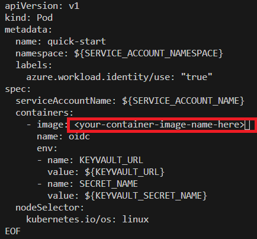

# Access Azure SQL Database using a .Net application running on AKS with Workload Identity
This article explains the steps required in setting up an Azure Kubernetes Service (AKS) cluster with Workload Identity enabled and running a .Net workload which accesses an Azure SQL Database using this particular identity. <br />

## 1. Setting up an AKS cluster with the Workload Identity enabled
Set up the AKS cluster with the Workload Identity enabled as mentioned in the document - https://learn.microsoft.com/en-us/azure/aks/learn/tutorial-kubernetes-workload-identity <br /><br />
<b>In the above document, dont perform the step related to the Pod deployment which is mentioned here - https://learn.microsoft.com/en-us/azure/aks/learn/tutorial-kubernetes-workload-identity#deploy-the-workload . This is because we will be modifying a sample application and then deploy this sample application to this AKS cluster. </b><br /><br />
The document also mentions setting up of Azure Key Vault and its integration. <b>It is not necessary for our PoC </b>, however I am not omitting the Azure Key Vault integration set-up since the upstream sample code that we would be using has Azure Key Vault integration code - and I dont intend to delete it. However you may take your own call on this. <br /><br />

## 2. Create the Azure SQL Database with access enabled for Managed Identity and with the Sample Database data.
As a second step, we create an Azure SQL Database with AAD authentication enabled. <br />
When the SQL Database Server is configured for the Azure SQL Database, enable the AAD authentication and set the Azure AD admin. <b>The documentation states that the user selected for the Azure AD admin should be different than the Microsoft account you have used to sign-up for your Azure subscription, so I have done the same - </b> https://learn.microsoft.com/en-us/azure/app-service/tutorial-connect-msi-azure-database?tabs=sqldatabase%2Cuserassigned%2Cdotnet%2Cwindowsclient#1-grant-database-access-to-azure-ad-user <br /> <br />
 <br /><br />

Also, select the option for the sample data to be populated as below. The below setting will populate the new database with the data for the sample AdventureWorksLT database. <br />
<br /><br />

Once the Azure SQL Database is created, log in to the Azure Portal using the Azure AD admin credentials which was set during the creation of the Azure SQL Database. <br />

Post that open the Azure SQL Database portal page which was created earlier and open the Query Editor. <br />
<br /><br />

Once this is done, execute the below statements in the Query Editor. The text <b><identity-name></b> is to be replaced with the <b>name</b> of the identity used for creation of the Workload Identity. This name would be already stored in the variable <b>USER_ASSIGNED_IDENTITY_NAME</b> (this variable was set during the AKS cluster configuration as mentioned in section 1. of this article) and then run the below commands. <br />

```
CREATE USER [<identity-name>] FROM EXTERNAL PROVIDER;
ALTER ROLE db_datareader ADD MEMBER [<identity-name>];
ALTER ROLE db_datawriter ADD MEMBER [<identity-name>];
ALTER ROLE db_ddladmin ADD MEMBER [<identity-name>];
GO
```
<br />

<b> For reference - </b>Similar steps carried out in this section are mentioned in points 1. and 2. of the document - https://learn.microsoft.com/en-us/azure/app-service/tutorial-connect-msi-azure-database?tabs=sqldatabase%2Cuserassigned%2Cdotnet%2Cwindowsclient <br /> <br />

## 3. Sample application
For the sample application code, refer to the GitHub repo - https://github.com/Azure/azure-workload-identity <br /><br />
Download this repo and refer to the .Net sample in the directory - <b>examples/msal-net/akvdotnet</b> <br/><br/>
In this downloaded code in the folder <b>akvdotnet</b>, we will be modifying the file by the name <b>Program.cs</b> by adding the code to access the Azure SQL Database. Below are the changes to be done as below: <br />

First, install the below .Net package in the .Net project as below: <br />
```
dotnet add package Microsoft.Data.SqlClient
```

In the file by the name <b>Program.cs</b>, add the below <b>using</b> statement: <br />

```
using Microsoft.Data.SqlClient;
```

Now add the below code to <b>Program.cs</b> file. This code needs to be added after the code where secrets from Azure Key Vault are being fetched:
```
                //**Code to connect to Azure SQL Database starts here**

                //Connect to Azure SQL Database
                Console.WriteLine("Attempting to connect to SQL Server");

                //Build a SqlConnection connection string. Replace the strings <your-sql-server-name> and <db-name> with the Server and Database name of your Azure SQL Database 
                SqlConnection connection = new SqlConnection("Server=tcp:<your-sql-server-name>.database.windows.net;Database=<db-name>;Authentication=Active Directory Default;TrustServerCertificate=True");
                try
                {
                    connection.Open();
                    Console.WriteLine("Connected to SQL Server");
                    //Fetch data from the table SalesLT.Customer
                    Console.WriteLine("Fetching data from table SalesLT.Customer");

                    String sql = "SELECT * from SalesLT.Customer";

                    using (SqlCommand command = new SqlCommand(sql, connection))
                    {
                        using (SqlDataReader reader = command.ExecuteReader())
                        {
                            while (reader.Read())
                            {
                                //Print the FirstName column in the Console
                                Console.WriteLine("{0} ", reader.GetString(3));
                            }
                        }
                    }
                    
                    
                }
                catch (Exception e)
                {
                    Console.WriteLine(e.ToString());
                }
                finally
                {
                    connection.Close();
                }

                //**Code to connect to Azure SQL Database ends here**
```
<b>For reference - </b> refer to section 3. of this document to understand the code required to connect to Azure SQL Database- https://learn.microsoft.com/en-us/azure/app-service/tutorial-connect-msi-azure-database?tabs=sqldatabase%2Cuserassigned%2Cdotnet%2Cwindowsclient#3-modify-your-code <br />

<b>For reference - </b> refer to this document which has the sample code to fetch the data from Azure SQL Database - https://learn.microsoft.com/en-us/azure/azure-sql/database/connect-query-dotnet-core?view=azuresql#insert-code-to-query-the-database-in-azure-sql-database <br />

<b>In this repo, I have uploaded the modified Program.cs which has all the above mentioned changes.</b><br /><br />

## 4. Deploy the application to the AKS cluster
With the changes mentioned in <b>section 3. </b>, build the container image and push it to the Azure Container Registry. <br />
Post that deploy this container to the AKS cluster which has Workload Identity enabled. If you have followed the steps mentioned in the documentation which I have referenced in <b>section 1. </b>of this article, then the step for deployment of the application to the AKS is mentioned here - https://learn.microsoft.com/en-us/azure/aks/learn/tutorial-kubernetes-workload-identity#deploy-the-workload 

Below image mentions the placeholder in the Pod's YAML manifest where you will need to mention the name of the container image that you have created: <br />


Once the application is deployed, check the logs of the application by running the below <b>kubectl</b> command: <br />
```
kubectl logs quick-start
```

<b>If the application is successful in accessing the Azure SQL Database using Workload Identity configured on AKS, then you should be able to see the sample data of Customer Names along with the other logs. Below are the logs that I am able to see for my application (partial logs): </b><br />


## Other reference links:
Explanation on Workload Identity (old video): 
https://www.youtube.com/watch?v=wZ0gCJYMUKI 

Explanation of Workload Identity on AKS (old video):
https://www.youtube.com/watch?v=O0ifOBOAe0Q

## **Views are personal. Reader's discretion advised. 
